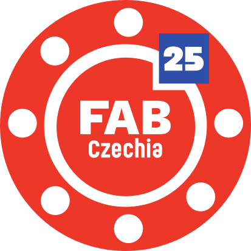
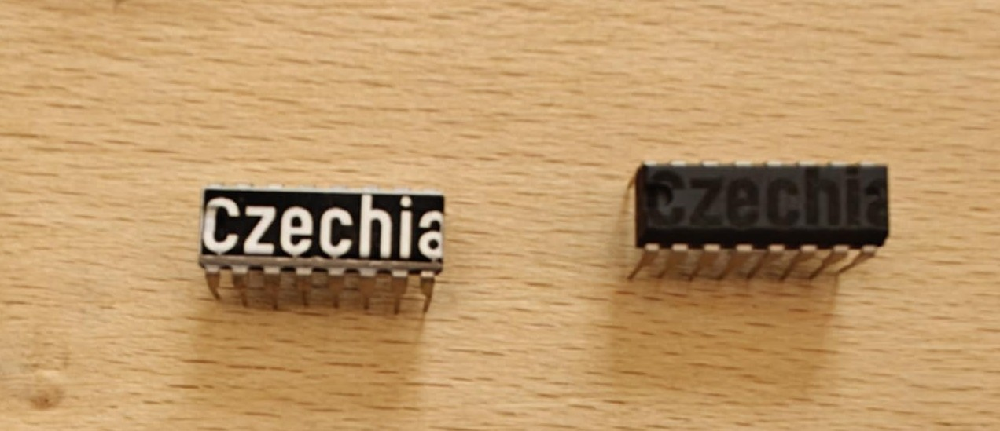
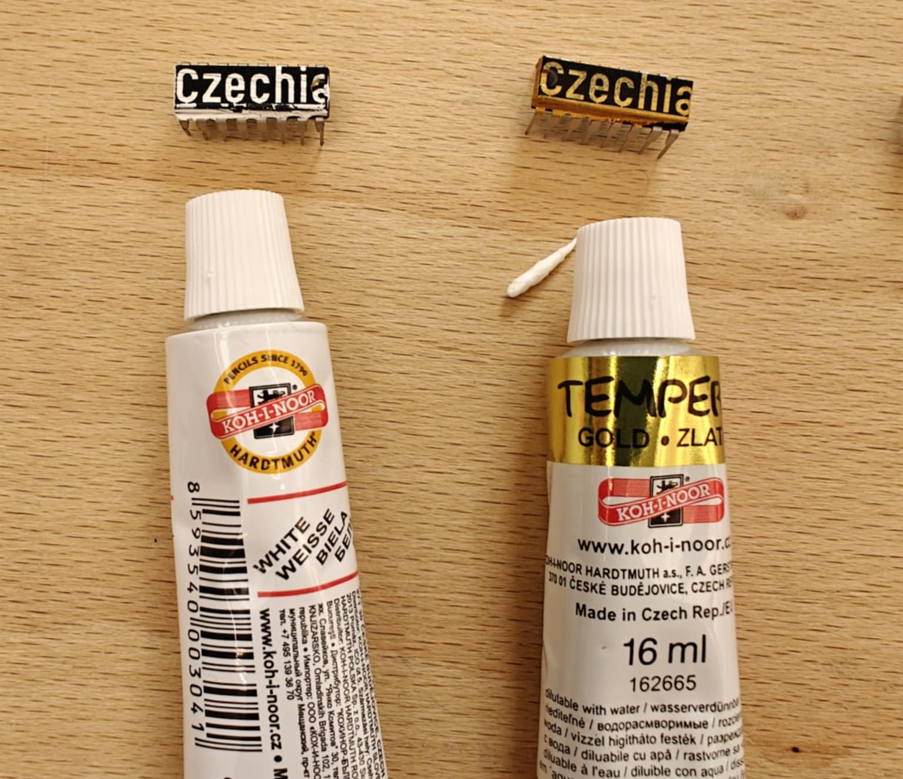
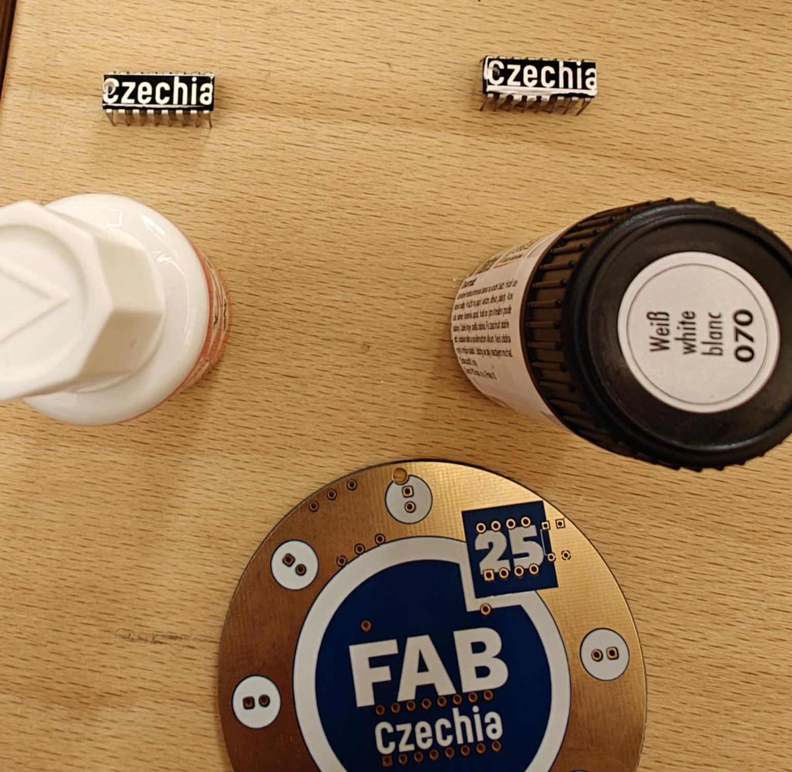
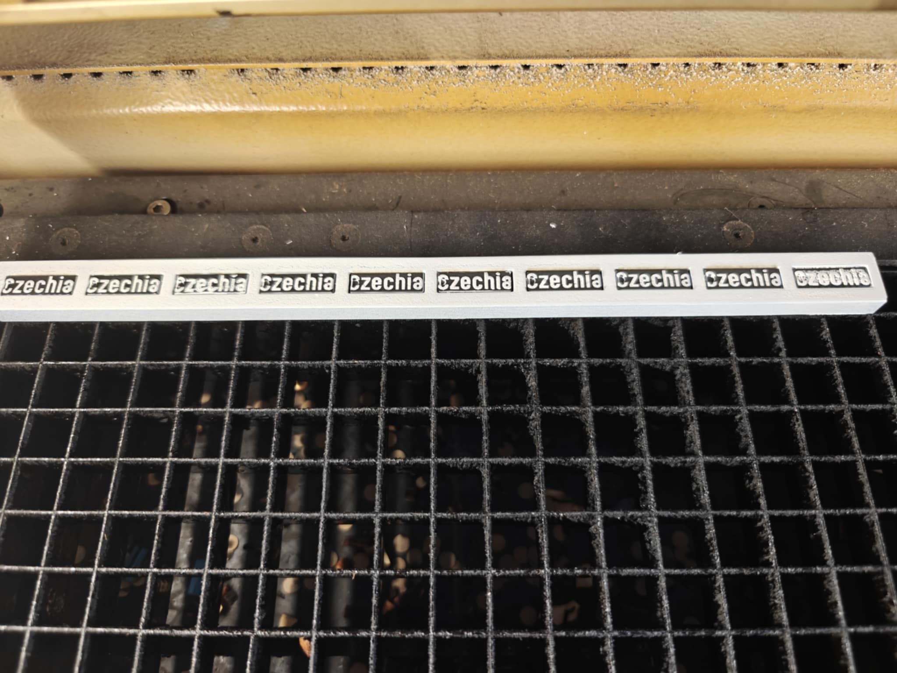
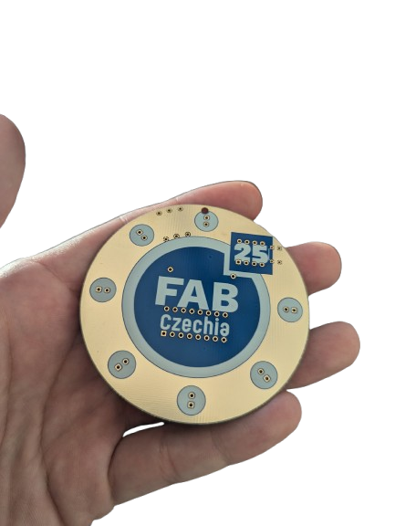
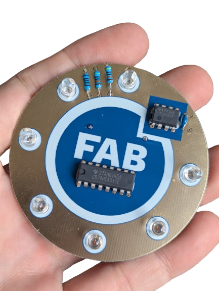
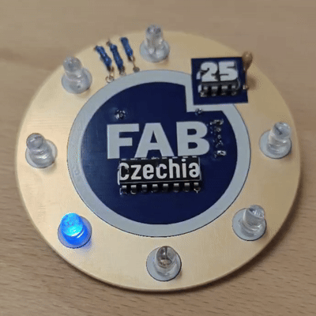

# FAB25_BADGE
We've been asked by our friends over at [FabLab Leuven](https://fablab-leuven.be/) to design a solder kit for the [FAB25](https://fab25.fabevent.org/) conference in Czechia.

## Design
In order to make the kit a bit more advanced we opted to use a [555 timer](https://www.ti.com/product/TLC555) IC to generator a clock signal for a [4017 counter](https://www.ti.com/product/CD4017B) IC. This will result in LEDs lighting up one by one around the logo. A slide switch on the back allows users to disable the light show to save power. 

## Chip marking
Since the ICs would cover op parts of the identifying marks of the logo, we opted to mark the ICs with "25" and "Czechia". This was done by laser engraving the ICs and filling those engravings with paint.

Sample chip engraving and painting.

First test with gold and white paint.

Testing with different white paints.

Mass engraving of the ICs in the laser cutter with a custom jig to speed up the process (a total of 2000 chips had to be marked).

## REV 00
Initial version of the design based on the [FAB25](https://fab25.fabevent.org/) logo.

## REV 01
Revision 01 is the mass production version of the kit. Besides an update to the graphical design and adding the sponsor logo, we als removed the unnecessary capacitor, added the switch and increased the animation speed by reducing the 470kΩ resistors to 100kΩ. 
R1 and R2 are 100kΩ, C1 is 1µF, the animation speed can be calculated using the following formula: f=1.44/[(R1+2*R2)C1]=4,8Hz

